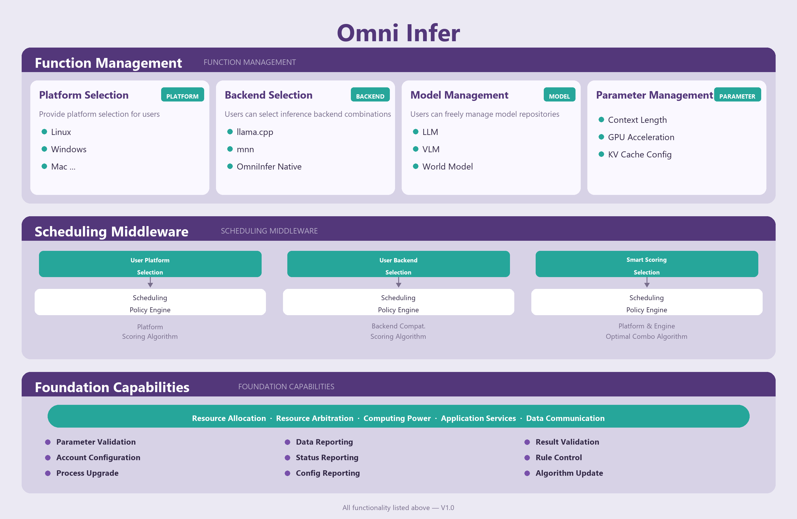

# OmniInfer

Easy, fast, and private LLM & VLM inference for every device

| [Documentation](#getting-started) | [Architecture](#architecture) | [Supported Models](#supported-models) |

## About

OmniInfer is a high-performance, cross-platform inference engine for running Large Language Models (LLM) and Vision-Language Models (VLM) locally. It abstracts away model compilation, hardware adaptation, and deployment complexity, enabling efficient local inference with minimal configuration.

> OmniInfer powers the inference layer of [Omni Studio](https://github.com/omnimind-ai/OmniStudio), a unified model orchestration platform.

OmniInfer is fast with:

- Optimized token generation speed and minimal memory footprint
- Multiple backend engines (llama.cpp, mnn, et, mlx, OmniInfer Native) for best-fit performance
- Hardware-aware adaptation and optimization

OmniInfer is flexible and easy to use with:

- Seamless multi-backend switching — choose the best engine for your workload
- OpenAI-compatible API server for drop-in integration
- Support for LLM, VLM, and World Models
- Fine-grained parameter control (context length, GPU offloading, KV cache, etc.)

OmniInfer runs everywhere:

- Linux, macOS, Windows — desktop & server
- Android, iOS — mobile & edge devices
- One codebase, all platforms

## Getting Started

## Architecture

## Contributing

We welcome and value any contributions and collaborations. Please check out [Contributing to OmniInfer](CONTRIBUTING.md) for how to get involved.

## License

This project is licensed under the Apache License 2.0 — see [LICENSE](LICENSE) for details.
