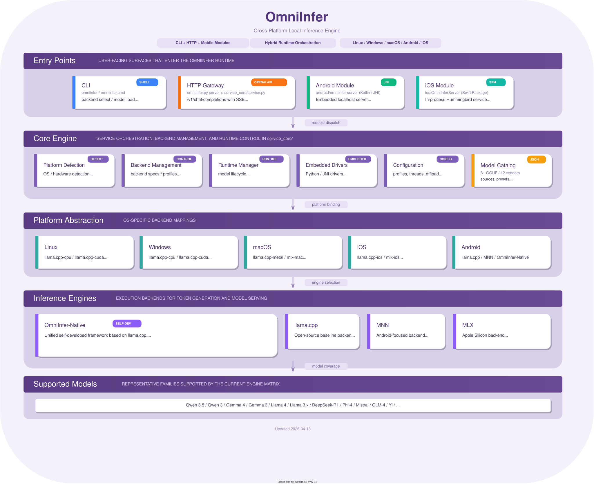

<p align="center">
  <picture>
    <source media="(prefers-color-scheme: dark)" srcset="docs/assets/omniinfer-logo-dark.svg">
    
  </picture>
</p>

# OmniInfer

<p align="center">Easy, fast, and private LLM &amp; VLM inference for every device.</p>

<p align="center">
  <a href="https://github.com/omnimind-ai/OmniInfer/actions/workflows/main-platform-ci.yml"></a>
  <a href="https://github.com/omnimind-ai/OmniInfer/releases/latest"></a>
  <a href="LICENSE"></a>
</p>

<p align="center">
  <a href="#quick-start"><strong>Quick Start</strong></a> ·
  <a href="#documentation"><strong>Documentation</strong></a> ·
  <a href="https://github.com/omnimind-ai/OmniInfer/releases"><strong>Releases</strong></a>
</p>

## Quick Start

### Install OmniInfer

<table>
  <thead>
    <tr>
      <th>Linux x64</th>
      <th>macOS arm64</th>
      <th>Windows x64 PowerShell</th>
    </tr>
  </thead>
  <tbody>
    <tr>
      <td><code>curl -fsSL https://raw.githubusercontent.com/omnimind-ai/OmniInfer/main/scripts/install.sh | bash</code></td>
      <td><code>curl -fsSL https://raw.githubusercontent.com/omnimind-ai/OmniInfer/main/scripts/install.sh | bash</code></td>
      <td><code>irm https://raw.githubusercontent.com/omnimind-ai/OmniInfer/main/scripts/install.ps1 | iex</code></td>
    </tr>
  </tbody>
</table>

The installers download the latest CLI-only GitHub Release, verify its SHA-256 checksum, and install it for the current user. For fixed versions, custom paths, manual installation, source setup, and removal, see [Installation](docs/installation.md).

### Start in three steps

1. Run `omniinfer` in a terminal.
2. Choose a compatible backend. The TUI can install an available prebuilt runtime for you.
3. Select a local model and start chatting.

To run the local OpenAI- and Anthropic-compatible service, start `omniinfer serve` and follow the [CLI Guide](docs/CLI.md) or [API Reference](docs/API.md). Source builds and mobile embedding are documented separately.

## Demo

The terminal UI guides backend selection, model loading, and local chat.

<table width="100%">
  <tr>
    <td width="100%">
      <video src="https://github.com/user-attachments/assets/4ac5329e-8c54-4ea9-8a51-02306c0607e9" autoplay muted loop playsinline width="100%" style="max-width: 100%;"></video>
    </td>
  </tr>
</table>

## News

- **2026-08-14** — 🚀 **Day-0 support for Qwen3.8-27B.** OmniInfer is ready for Qwen's latest 27B vision-language model from day one.

## About

OmniInfer is a high-performance, cross-platform inference engine for running Large Language Models (LLM) and Vision-Language Models (VLM) locally. It abstracts away model compilation, hardware adaptation, and deployment complexity, enabling efficient local inference with minimal configuration.

> OmniInfer powers the inference layer of [Omni Studio](https://omnimind.com.cn/omnistudio), a unified model orchestration platform.

OmniInfer is fast with:

- Optimized token generation speed and minimal memory footprint
- Multiple backend engines, including llama.cpp, ik_llama.cpp, MNN, MLX, TurboQuant, LiteRT-LM, ExecuTorch QNN, and OmniInfer Native where supported
- Hardware-aware adaptation and optimization

OmniInfer is flexible and easy to use with:

- Seamless multi-backend switching for the best available engine on each device
- OpenAI-compatible and Anthropic-compatible local API endpoints
- Support for text and vision-language workloads
- Fine-grained parameter control for context length, GPU offloading, KV cache, and backend-native launch options

OmniInfer runs everywhere:

- Linux, macOS, Windows — desktop and server
- Android and iOS — mobile and edge devices
- One codebase across CLI, HTTP gateway, and mobile modules

## Platform Support

| Platform | Distribution | Representative runtimes |
|---|---|---|
| Linux x64 | Release CLI and source checkout | llama.cpp, ik_llama.cpp, vLLM, vla.cpp |
| macOS arm64 | Release CLI and source checkout | llama.cpp, MLX, TurboQuant |
| Windows x64 | Release CLI and source checkout | llama.cpp, vLLM through WSL2 |
| Android | Gradle module | llama.cpp, MNN, LiteRT-LM, ExecuTorch QNN |
| iOS | Swift package | Embedded native inference service |

Runtime availability depends on the device and accelerator. Use `omniinfer backend list` for the current machine and see the [Build Guide](docs/build.md) for the full platform matrix.

## Documentation

### Start here

- [Installation](docs/installation.md): Release installers, version pinning, source setup, manual installation, and removal
- [CLI Guide](docs/CLI.md): Backend installation, model loading, chat, serving, and desktop integration
- [API Reference](docs/API.md): Local OpenAI- and Anthropic-compatible HTTP APIs

### Operate and integrate

- [Model Loading](docs/model-load.md): Model discovery, parameters, and backend-specific behavior
- [Remote Access](docs/remote-access.md): LAN access, Cloudflare Quick Tunnel, reverse proxies, and security
- [Benchmark Results](docs/benchmark.md): Generate and archive submission-compatible benchmark JSON

### Build and embed

- [Build Guide](docs/build.md): Source checkout, backend builds, and platform packaging
- [Android Integration](docs/android/integration.md): Embed OmniInfer in an Android application
- [Android Backend Reference](docs/android/backends.md): Android runtime choices and requirements
- [Android Smoke Tests](docs/android/smoke-tests.md) and [Troubleshooting](docs/android/troubleshooting.md)

## Architecture



## Contributing

We welcome contributions and collaborations. See [Contributing to OmniInfer](CONTRIBUTING.md) to get involved.

## Citation

If you use OmniInfer in research, cite this repository. GitHub can generate additional formats from [CITATION.cff](CITATION.cff).

```bibtex
@software{omniinfer,
  author = {{Omnimind AI}},
  title = {OmniInfer},
  url = {https://github.com/omnimind-ai/OmniInfer}
}
```

## License

OmniInfer is licensed under the Apache License 2.0. See [LICENSE](LICENSE).
